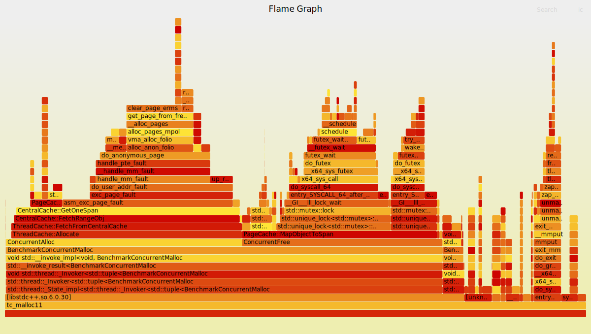

# Tiny-TCMalloc LINUX版本🚀

**Tiny-TCMalloc** 是一个 LINUX 版本的 TCMalloc 内存分配器实现，专注于LINUX高效的内存管理和多线程支持。  
该项目由cmake构建，是学习C++、LINUX、内存分配器设计、多线程编程、Linux性能分析的绝佳实践。

## 简介 📖

Tiny-TCMalloc 是一个基于 TCMalloc 思想的Linux内存分配器，旨在提供高效的内存分配和释放功能，同时支持多线程环境。通过分层的内存管理机制（ThreadCache、CentralCache、PageCache），Tiny-TCMalloc 能够有效地减少锁竞争并提高内存分配性能

## 快速开始 🌟
```bash
mkdir build
cd build
cmake ..
make
./bench/bench_demo 
```


## 存在问题 🌟
todo：  
1、完善docker环境，安装性能分析相关工具链  
2、目前有概率性存在内存泄漏，可能与存在锁异常竞争  
3、与原生malloc，free慢，待后续优化

  


## 参考链接
https://github.com/google/tcmalloc  

https://github.com/atongrun/tcmalloc-mini  

